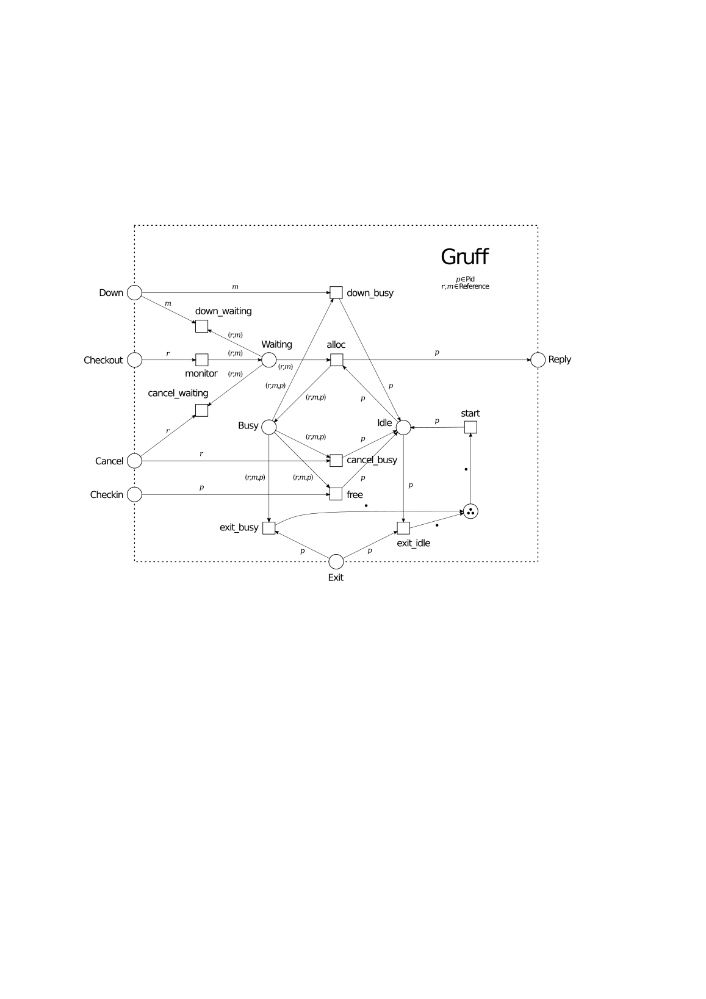
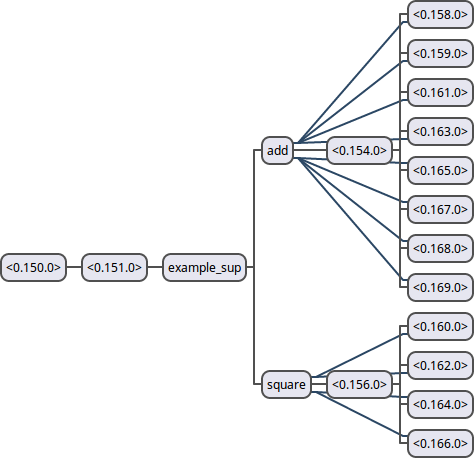

# gruff
###### A basic worker pool manager for Erlang to showcase gen_pnet.

[](https://hex.pm/packages/gruff) [](https://travis-ci.org/joergen7/gruff)

This library allows the management of a fixed-size worker pool from which generic worker instances can be allocated, used, and released. gruff automatically restarts any failing worker and a worker is automatically released if the allocating client fails.

The interface and behavior of the gruff library are intentionally close to the [poolboy](https://github.com/devinus/poolboy) worker pool factory and bears resemblance to other Erlang worker pool managers like [pooler](https://github.com/seth/pooler) or [worker_pool](https://github.com/inaka/worker_pool). This allows the comparison of performance, features, and implementation details. Herein, gruff is the attempt to max out simplicity and clarity in the implementation to demonstrate the expressive power of the [gen_pnet](https://github.com/joergen7/gen_pnet) behavior.



*Figure 1: Petri net model of the gruff interface and internal behavior with three worker processes.*

## Features

### Load Balancing on a Fixed Number of Processes

Concurrent applications often comprise processes with different characteristics. While some processes are long-lived others are only ephemeral. While some processes are cheap to initialize and use only little memory others have a high start-up cost or take up a lot of memory. In the consequence, certain process types can or should be started only in a limited number. The remaining components of the system share these processes among them. gruff once initializes a process population of fixed size. Access to these processes is ensured to be mutually exclusive. This means that, in the absence of failure, the startup cost has to be paid only once and that the cost of running these processes is independent of the system load.

### Automatic Error Handling for Client and Worker Failures

Allocating worker processes for client processes implies that either may fail before the worker leaves its critical section. If the worker fails a new worker needs to be started so that the number of worker processes remains constant. If the client fails the worker needs to be freed immediately, so that it can be used by waiting clients. Detecting client failure is achieved by creating a monitor on every client prior to allocating a worker process. If a waiting client fails, it is simply evicted from the waiting queue. If a client with an allocated worker process fails, the process is freed. Detecting worker failure is achieved by linking to all workers. If a worker fails, a new worker is started in its place no matter whether the worker was idle or busy at the time of failure.

### Simple and Predictable

Many worker pool managers are available in the Erlang ecosystem (see [Related Worker Pool Managers](#related-worker-pool-managers) section). The distinguishing feature of gruff is its simplicity. The Petri net in Figure 1 describes its behavior exhaustively. So, verifying that gruff is correct boils down to looking up whether all graph components in Figure 1 also appear in the source and that the edges and edge labels are transcribed correctly. The details of synchronization, process life-cycle, and message-box sitting in Erlang appear only sporadically anymore.

## Usage

### Adding gruff to a Project

#### rebar3

To integrate gruff into a rebar3 managed project change the `deps` entry in your application's `rebar.config` file to include the tuple `{gruff, "0.1.0"}`.

```erlang
{deps, [{gruff, "0.1.0"}]}.
```

#### mix

```elixir
{:gruff, "~> 0.1.0"}
```

### Example: Adding and Squaring Numbers

Here, we set up an example application for adding and squaring numbers. The application creates two worker pools of different sizes: One pool for adding a pair of numbers with eight worker processes, and one for squaring a number with four worker processes. The configuration of the two worker pools is defined in the environment variables of the application and the two worker pools as well as the application supervisor are registered processes named `example_sup`, `add`, and `square`.

We show how to configure the application, how to create a module implementing the application and supervisor callbacks as well as some API functions, and how to create the adding and squaring modules as gen_server implementations. Eventually, we demonstrate how to start the application, query both pools, and shut it down again.



*Figure 2: Process hierarchy of the example application. Black connections are child relations while blue connections are links. The application has three named processes: `example_sup`, `add`, and `square`.*

#### example.app

```erlang
{application, example,
 [{description, "A gruff example application"},
  {vsn, "0.1.0"},
  {registered, [example_sup, add, square]},
  {mod, { example, []}},
  {applications,
   [kernel,
    stdlib
   ]},
  {modules, [example, add_wrk, square_wrk]},
  {env,[
        {pool_lst, [
                    #{ id => add,    size => 8, mod => add_wrk,    args => [] },
                    #{ id => square, size => 4, mod => square_wrk, args => [] }
                   ]}
       ]}
 ]}.
```

#### example.erl

```erlang
-module( example ).
-behavior( application ).
-behavior( supervisor ).

-export( [start/0, stop/0, add/2, square/1] ).
-export( [start/2, stop/1] ).
-export( [init/1] ).

start() -> application:start( ?MODULE ).

stop() -> application:stop( ?MODULE ).

add( A, B ) ->
  F = fun( Wrk ) ->
        gen_server:call( Wrk, {add, A, B} )
      end,
  gruff:transaction( add, F ).

square( X ) ->
  F = fun( Wrk ) ->
        gen_server:call( Wrk, {square, X} )
      end,
  gruff:transaction( square, F ).

start( _StartType, _StartArgs ) ->
  supervisor:start_link( {local, example_sup}, ?MODULE, [] ).

stop( _State ) -> ok.

init( [] ) ->

    {ok, PoolLst} = application:get_env( example, pool_lst ),

    ChildSpecs = [#{ id       => Id,
                     start    => {gruff, start_link, [{local, Id}, WrkMod,
                                                      WrkArgs, Size]},
                     restart  => permanent,
                     shutdown => 5000,
                     type     => worker,
                     modules  => [gruff]
                   } || #{ id   := Id,
                           size := Size,
                           mod  := WrkMod,
                           args := WrkArgs
                         } <- PoolLst],

    SupFlags = #{ strategy  => one_for_one,
                  intensity => 10,
                  period    => 10 },

    {ok, {SupFlags, ChildSpecs}}.
```

#### add_wrk.erl

```erlang
-module( add_wrk ).
-behaviour( gruff_wrk ).
-behaviour( gen_server ).

-export( [start_link/1] ).
-export( [code_change/3, handle_call/3, handle_cast/2, handle_info/2, init/1,
          terminate/2] ).

start_link( WrkArgs ) -> gen_server:start_link( ?MODULE, WrkArgs, [] ).

code_change( _OldVsn, State, _Extra )    -> {ok, State}.
handle_call( {add, A, B}, _From, State ) -> {reply, A+B, State}.
handle_cast( _Request, State )           -> {noreply, State}.
handle_info( _Info, State )              -> {noreply, State}.
init( _Args )                            -> {ok, []}.
terminate( _Reason, _State )             -> ok.
```

#### square_wrk.erl

```erlang
-module( square_wrk ).
-behaviour( gruff_wrk ).
-behaviour( gen_server ).

-export( [start_link/1] ).
-export( [code_change/3, handle_call/3, handle_cast/2, handle_info/2, init/1,
          terminate/2] ).

start_link( WrkArgs ) -> gen_server:start_link( ?MODULE, WrkArgs, [] ).

code_change( _OldVsn, State, _Extra )    -> {ok, State}.
handle_call( {square, X}, _From, State ) -> {reply, X*X, State}.
handle_cast( _Request, State )           -> {noreply, State}.
handle_info( _Info, State )              -> {noreply, State}.
init( _Args )                            -> {ok, []}.
terminate( _Reason, _State )             -> ok.
```

#### Using the Example Application

    example:start().

    example:add( 1, 2 ).
    {ok, 3}

    example:square( 4 ).
    {ok, 16}

    example:stop().

## Related Worker Pool Managers

Worker pool managers are a staple of Erlang applications. Here, we compare gruff with several popular Erlang worker pool managers.

### poolboy

- poolboy allows both blocking and non-blocking checkout (only blocking checkout is supported in gruff).
- poolboy uses a fifo/lifo worker allocation strategy while gruff uses a non-deterministic allocation strategy instead.
- Only a part of the worker instances are started right away. Overflow workers are started if this initial worker contingent does not suffice to handle all requests. In contrast, the number of workers in gruff is fixed (no overflow).
- In contrast to gruff, poolboy prefers exception handling over `{ok, Result} | {error, Reason}` return values.

### pooler

- pooler allows both blocking and non-blocking checkout.
- In gruff (as in poolboy) workers have to implement a worker behavior (`gruff_wrk`) which exposes a `start_link/1` function used to start workers. In pooler, workers are started via an `{M, F, A}` triple.
- Worker allocation strategies and strategies for pool growth can be controlled by the user.
- pooler integrates [exometer](https://github.com/Feuerlabs/exometer) for instrumentation.
- A pooler instance manages several worker pools, while each gruff instance represents only a single pool of homogeneous workers.
- pooler allows pools to be subsumed in groups, thereby adding an additional layer of partitioning.
- pooler allows sending messages to all currently unallocated members of a pool.

### worker_pool

- worker_pool does not directly expose the worker process to the allocating client. Instead, it manages message passing to and from the worker process by wrapping the calling and event handling APIs of gen_server and gen_fsm.
- The workers under worker_pool have to implement either the gen_server or gen_fsm behavior in contrast to poolboy and gruff, where a worker behavior has to be implemented and in contrast to pooler which manages generic worker modules.
- In worker_pool, restarting of failed workers is performed by the supervisor process while poolboy and gruff detect and restart failed workers as a top-level activity.
- Accordingly, the user has complete control over the supervisor process's restart strategy.
- worker_pool can be configured to issue warnings if workers take too long to generate replies.

## System Requirements

- Erlang OTP 18.0 or higher
- Rebar3 3.0.0 or higher

## Resources

- [devinus/poolboy](https://github.com/devinus/poolboy). A hunky Erlang worker pool factory.
- [seth/pooler](https://github.com/seth/pooler). An OTP process pool application.
- [inaka/worker_pool](https://github.com/inaka/worker_pool). An Erlang worker pool.
- [aberman/pooly](https://github.com/aberman/pooly). An Erlang OTP process pool.
- [joergen7/gen_pnet](https://github.com/joergen7/gen_pnet). A generic Petri net OTP behavior.

## Authors

- Jorgen Brandt (joergen7) [joergen.brandt@onlinehome.de](mailto:joergen.brandt@onlinehome.de)

## License

[Apache 2.0](https://www.apache.org/licenses/LICENSE-2.0.html)