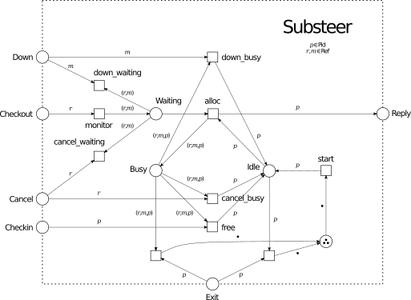

# substeer
###### A basic worker pool factory for Erlang to demonstrate the expressive power of gen_pnet.

 

This library allows the management of a fixed-size worker pool from which generic worker instances can be allocated, used, and released. Communication is strictly asynchronous. Substeer automatically restarts any failing worker and a worker is automatically released if the allocating client fails prior to releasing the worker.

The interface and behavior of the substeer library are intentionally close to the [poolboy](https://github.com/devinus/poolboy) worker pool factory. This allows the comparison of performance, features, and implementation details. Herein, substeer is the attempt to max out simplicity and clarity in the implementation to showcase the expressive power of the [gen_pnet](https://github.com/joergen7/gen_pnet) behavior.

*Petri net model of the substeer interface and internal behavior.*

## Differences to poolboy

- non-blocking checkout unsupported.
- synchronous checkout unsupported.
- non-deterministic worker allocation strategy instead of fifo/lifo allocation strategies.
- the number of workers is fixed (no overflow feature)

## System Requirements

- Erlang OTP 18.0 or higher
- Rebar3 3.0.0 or higher

## Resources

- [joergen7/gen_pnet](https://github.com/joergen7/gen_pnet). A generic Petri net OTP behavior.
- [devinus/poolboy](https://github.com/devinus/poolboy). A hunky Erlang worker pool factory.

## Authors

- Jorgen Brandt (joergen7) [joergen.brandt@onlinehome.de](mailto:joergen.brandt@onlinehome.de)

## License

[Apache 2.0](https://www.apache.org/licenses/LICENSE-2.0.html)