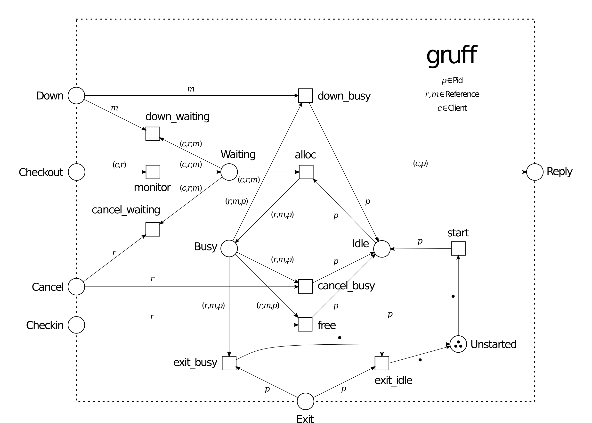

# gruff
###### A basic worker pool factory for Erlang to demonstrate the expressive power of gen_pnet.

 

This library allows the management of a fixed-size worker pool from which generic worker instances can be allocated, used, and released. Gruff automatically restarts any failing worker and a worker is automatically released if the allocating client fails.

The interface and behavior of the gruff library are intentionally close to the [poolboy](https://github.com/devinus/poolboy) worker pool factory and bears resemblance to other Erlang worker pool managers. This allows the comparison of performance, features, and implementation details. Herein, gruff is the attempt to max out simplicity and clarity in the implementation to showcase the expressive power of the [gen_pnet](https://github.com/joergen7/gen_pnet) behavior.

*Petri net model of the gruff interface and internal behavior with three worker processes.*

## Differences to other process pool managers

### poolboy

- checkout calls are always blocking (no non-blocking checkout)
- non-deterministic worker allocation strategy instead of fifo/lifo allocation strategies
- the number of workers is fixed (no overflow)
- preference of `{ok, Result} | {error, Reason}` return values over exception handling

### pooler

### worker_pool

## System Requirements

- Erlang OTP 18.0 or higher
- Rebar3 3.0.0 or higher

## Resources

- [joergen7/gen_pnet](https://github.com/joergen7/gen_pnet). A generic Petri net OTP behavior.
- [devinus/poolboy](https://github.com/devinus/poolboy). A hunky Erlang worker pool factory.
- [seth/pooler](https://github.com/seth/pooler). An OTP process pool application.
- [inaka/worker_pool](https://github.com/inaka/worker_pool). Erlang worker pool.

## Authors

- Jorgen Brandt (joergen7) [joergen.brandt@onlinehome.de](mailto:joergen.brandt@onlinehome.de)

## License

[Apache 2.0](https://www.apache.org/licenses/LICENSE-2.0.html)